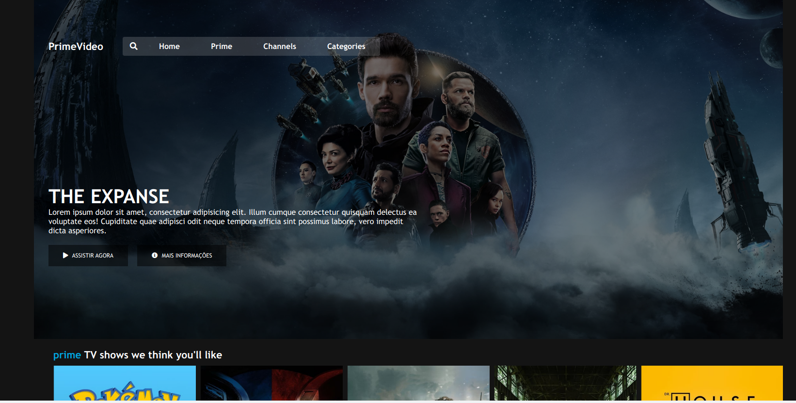
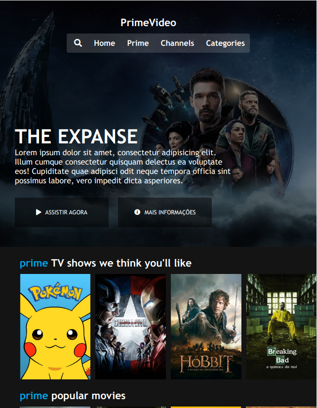

# clone-prime-video
Estudo de caso, ainda no modo clonagem, utilizando as mesmas técnicas da clonagem NETFLIXIANA no Prime Vídeo. A ideia não é criar um clone perfeito, mas reproduzir  a experiência do usuário minimamente, como se estivesse dentro do prime video.

